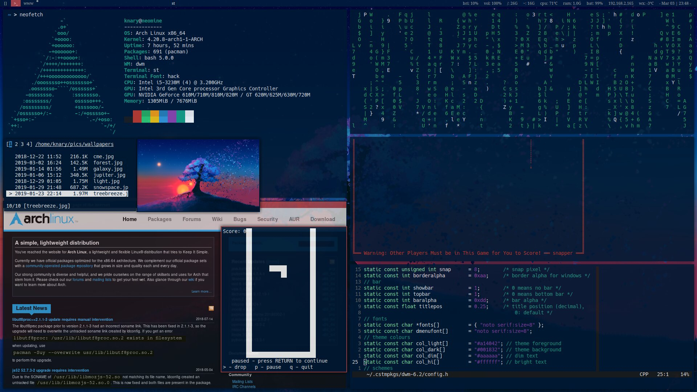

 ```_                           _           _       _
| | ___ __   __ _ _ __ _   _( )___    __| | ___ | |_ ___
| |/ / '_ \ / _` | '__| | | |// __|  / _` |/ _ \| __/ __|
|   <| | | | (_| | |  | |_| | \__ \ | (_| | (_) | |_\__ \
|_|\_\_| |_|\__,_|_|   \__, | |___/  \__,_|\___/ \__|___/
                       |___/
```

# knary's Dots
My Dotfiles and Configs.

**WM**: [dwm](dwm.suckless.org)

- Patches: tilegap, hide vacant tags, pertag, alpha, noborder
(for single window), titlecolor, scratchpad, attachbottom, 
movestack, left layout, statusmon

- Unofficial patches: titlepos, statuspos, remove gap on single,
change/toggle gaps,
 
*Custom colours, custom status bar script (check .scripts, ran from .xinitrc)*

**Term**: [st](st.suckless.org)

- Patches: scrollback, scrollback mouse, clipboard, bold is not
bright

- Unofficial patches: cursor blink

*Custom colours*
<br></br>
*Check the st and dwm directories for key bindings and more info about their builds.*

# In Action

<!--  -->


<!-- **Wallpaper**: [Tree and Breeze](https://www.deviantart.com/joeyjazz/art/Just-a-tree-and-a-breeze-782449448) -->
**Wallpaper**: [Minimalist Desert](https://www.heroscreen.cc/2019/12/desktop-wallpaper-minimalist-desert.html)
